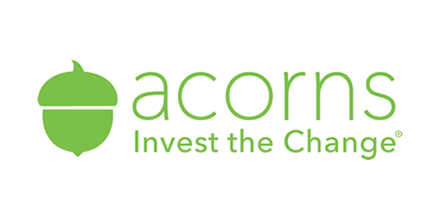

# 
# <u>*A Big Pile of Nuts - A Case Study*</u>
---
## *Overview and Origin*
---
- Legal Name: *Acorns Grow Inc.*
- Acorns was incorporated in <u>2012</u> and later launched an app for iOS and Android devices and became known in 2014.
- The founders of Acorns are father and son duo Walter Wemple Cruttenden III and Jeffery Cruttenden. Acorns is now led by current CEO Noah Kerner.
- The idea behind the company was to provide a service and product to consumers with the goal of promoting gradual savings that would lead to passive investing. The idea that your extra change from transactions would get set aside, saved, and invested, leading to accumulation over time. In other words, all your little acorns saved would eventually grow into a big oak tree for you to retire on.
- According to [Crunchbase](https://www.crunchbase.com/organization/acorns-grow), since being founded in 2012, Acorns has raised over $500 million through 10 different funding rounds from venture capital funding including support from several [celebrity investors](https://www.acorns.com/about/) as well as large corporate backers like Black Rock Inc and Paypal Holdings Inc. They had plans to release an IPO in 2022 with SPAC Pioneer Merger Corp. in the amount of $2.2 billion but subsequently [cancelled the offering](https://www.pymnts.com/news/ipo/2022/investment-platform-acorns-calls-off-ipo-with-pioneer-spac/) citing market conditions as the primary reason to hault the IPO. 
---
## *Business Activities*
---
- Acorns finds itself operating in a few different FinTech domains such as: Personal Finance, Online Banking, Robo-advising
