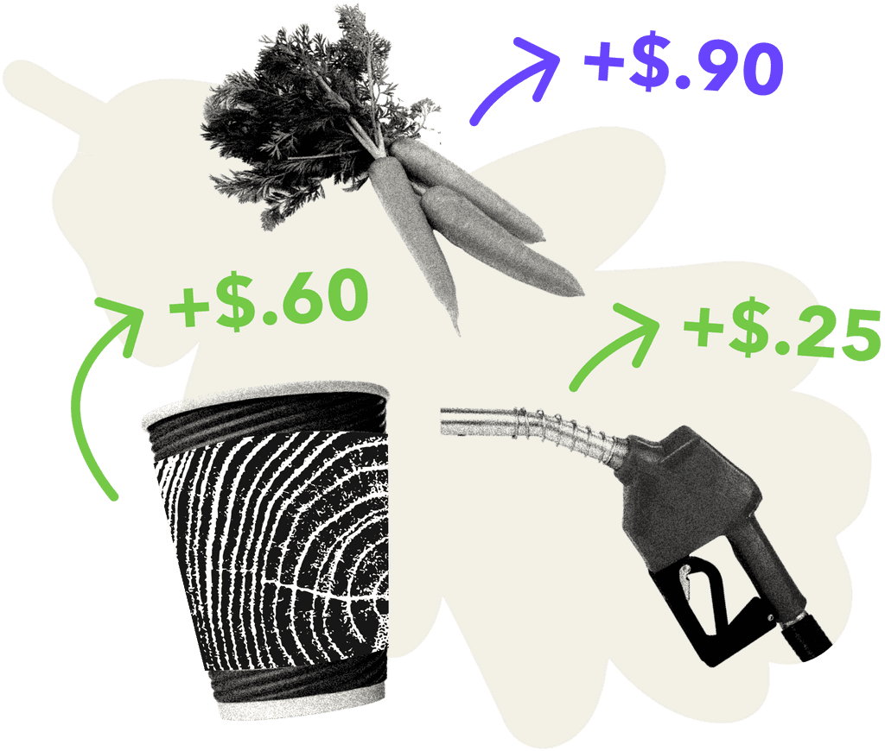

# <u>*A Big Pile of Nuts - A Case Study*</u>
---
## *Overview and Origin*
---
- Legal Name: *Acorns Grow Inc.*
- Acorns was incorporated in <u>2012</u> and later launched an app for iOS and Android devices and became known in 2014.
- The founders of Acorns are father and son duo Walter Wemple Cruttenden III and Jeffery Cruttenden. Acorns is now led by current CEO Noah Kerner.
- The idea behind the company was to provide a service and product to consumers with the goal of promoting gradual savings that would lead to passive investing. The idea that your extra change from transactions would get set aside, saved, and invested, leading to accumulation over time. In other words, all your little acorns saved would eventually grow into a big oak tree for you to retire on.
- According to [Crunchbase](https://www.crunchbase.com/organization/acorns-grow), since being founded in 2012, Acorns has raised over $500 million through 10 different funding rounds from venture capital funding including support from several [celebrity investors](https://www.acorns.com/about/) as well as large corporate backers like Black Rock Inc and Paypal Holdings Inc. They had plans to release an IPO in 2022 with SPAC Pioneer Merger Corp. in the amount of $2.2 billion but subsequently [cancelled the offering](https://www.pymnts.com/news/ipo/2022/investment-platform-acorns-calls-off-ipo-with-pioneer-spac/) citing market conditions as the primary reason to hault the IPO. 
---
## *Business Activities*
---

- The specific problem Acorns is trying to solve is how to help people who dont have much money, knowledge in investing, or time can still invest and begin saving for retirement. 
- Acorns intended customer is for people who are looking to start investing their money but maybe dont have a large amount of capital to start with or enough education to do it on their own. They also need to be tech savy enough to be comfortable working with apps on their phones. As a result this demographic makeup is primarily Millenials. According to the Fed, Millenials held only [2.5 percent](https://markets.businessinsider.com/news/stocks/millennial-stock-ownership-minuscule-compared-to-gen-x-boomers-2021-11) of the total shares invested in the stock market as of June 2022. This means that Millenial market share is a fraction of generations prior. Acorns looks to help get the investment ball rolling. Their services allow for their customer's transactions to get rounded up to the nearest dollar, and take the change on each transaction and make micro-investments into established ETF based portfolios created by Acorns and its securities trading partners. They want to make the barrier to entry in investing as small as possible. By automating their trasnaction rounding service, the customer's risiduals from purchases gets invested automatically without the need to reach out to a broker or purchase a security themselves. If so inclined the customer can take advantage of [learning resources](https://www.acorns.com/learn/) available as well if they want to begin building up their knowledge base for investing. 

- The great advantage that Acorns tries to lean on is that they have set up their model to be passive for the consumer. The headaches that are involved with setting up a budget, conciously saving money for the purpose of investing is no easy task. They take the approach that if you are willing to pay $4.25 for a coffee at Starbucks, you will probably be willing to pay $5.00 and invest the $0.75 difference every time you get one. The same goes for all purchases. By investing directly into ETFs, they make sure the customer has a balanced portfolio no matter the amount of money or lack thereof invested. 

- Acorns is actively using over 70 technology products including HTML5, jQuery, and Google Analytics. Additionally, AI automation and machine learning is a focal point and key to their operations utilizing their Acorns' Round-Ups product and portfolio allocation. Linking a credit card to the app allows the app to communicate with the card to round up transactions after purchases are made and invests the change into their automated portfolio that is set based on how agressively the user wants their  portfolio.  

---
## *Industry Landscape*
---

- Acorns finds itself operating primarily in Personal Finance and Online Banking. And although Acorns is not a bank, they have partnered with Visa and Lincoln Savings Bank to help them offer banks accounts as well as debit cards for transactions, savings, and investing all in one.
- With the acceleration of technology and its infusion into every industry sector, personal finance and banking have had significant shifts in the last decade. No longer are you required to go to your local branch to open an account or deal with a banker or advisor. No longer are people required to track their expenses or budgets through hand written ledgers or even excel spreadsheets. New applications surface every day that have the capabilites to help categorize, summarize and plan personal budgeting and finance as well as give insights and investing guidance all from the phone in your pocket. Banking has even moved beyond the option of adding online banking to becoming completely virtual where there are no physical bank branches to go to. This combined with the increasing development of machine learning and robo-investing continues to accelerate the landscape in terms of ease of use, efficiency, and free from human error. 
- With the increase interest and demand for investment apps, Acorns has built up a long list of competitors. Some of these competitors include: Robinhood, Plynk Invest, Stash, SoFi Invest, and Webull, amongst others. Every investing app works a little differently and is geared for a slightly different user. Where Robinhood and Webull are designed for investors who are looking to trade more themselves and have some basic knowledge of investing, Acorns and Plynk are set to cater more to very beginners or people just entering the market. 

---
## *Results*
---
- Acorns has had a significant impact since its app launch in 2014. Acorns reports having over 10 million customers all-time and more than $15 billion invested by users. 
- The biggest metric to show success for a company like Acorns is going to be the *number of subscribers* to their service. They charge a monthly fee to set up an account and to utilize their services ($3-$5 per month depending on plan). Beyond that they are going to look at *retention rate, churn rate, monthly active users (MAU), and to track if customers are increasing investments over time (ie. do they have continued confidence in the product?).* As of August of 2021 Acorns had 4 million paid plan subscribers, and over 10 million users all time. Compare this with its competitors: Robinhood - 12.2 million MAU, Webull - 11 million register users, SoFi - 3.5 million members. Plynk being most similar to Acorns in terms of its structure is relatively new and hasn't gained the traction that Acorns or the other retail investor platforms have.

---
## *Recommendations*
---
- Looking at Acorns it is clear when it comes to setting up a *passive* investment strategy with micro investments, they are leading the charge. However the area where they fall short is competing with the retail investment platforms where users can directly get involved with their portfolios. The biggest area of growth I can see where they should shift into is allowing users the ability to be active in crafting their portfolios, which as it would have it, is their [plan for the future](https://techcrunch.com/2022/03/09/acorns-squirrels-away-300m/). I would consider taking it a step further, beyond setting up a customizable long term investment portfolio, they look at adding a more comprehensive trading platform that will allow the ability for retail day trading in addition to the more long-term retirement accounts they offer. This is going to create a one stop shop for a much wider array of user and grow their pool of potentials exponentially.

- Acorns intends to roll out customizable portfolios and also create the ability for crytpo exposure. On the subject of customized portfolios, CEO Noah Kerner said in an interview following the cancellation of the SPAC IPO, "Active egagement helps people learn more, so at the moment of decision-making we're bringing together educational content and product in the same place." Continued "active engagement" is key to keeping Acorns relavent in an ever growing and accelerating industry. When their beginner investors have been with them for a couple years, they will no longer consider themselves beginners and will most likely want a more hands-on option to their strategies. Acorns can adapt to offer this or risk losing users.
- In order to set up a retail trading platform, Acorns is going to have to look at creating algorithmic predictor tools for retailers, additional machine learning applications, and probably increased cybersecurity for their platform. 
- These technologies are going to help set up the infrastructure that the trading platform would be based on in order to offer beginner to intermediate investors user friendly tools to help them trade. They already rely heavily on AI and machine learning for their automated investing. It would only make sense to lean on those tools further and create new uses for developments to come. If Acorns wants to remain relavent during the acceleration of the FinTech industry, they will want to keep educating and empowering their users and keep pushing themselves.

---
## *Sources*
---
https://en.wikipedia.org/wiki/Acorns_(company)

https://www.pymnts.com/news/ipo/2022/investment-platform-acorns-calls-off-ipo-with-pioneer-spac/

https://www.investopedia.com/articles/company-insights/090516/how-acorns-works-and-makes-money.asp

https://www.crunchbase.com/organization/acorns-grow

https://www.bankrate.com/investing/millennials-investing-trends-and-stats/#:~:text=Millennials%20held%20just%202.4%20percent,reach%20their%20peak%20earning%20years.

https://markets.businessinsider.com/news/stocks/millennial-stock-ownership-minuscule-compared-to-gen-x-boomers-2021-11

https://techcrunch.com/2022/03/09/acorns-squirrels-away-300m/

https://www.fintechbusiness.com/wealth/716-acorns-introduces-machine-learning-feature
